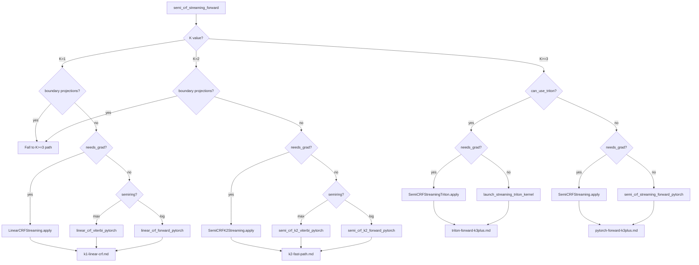
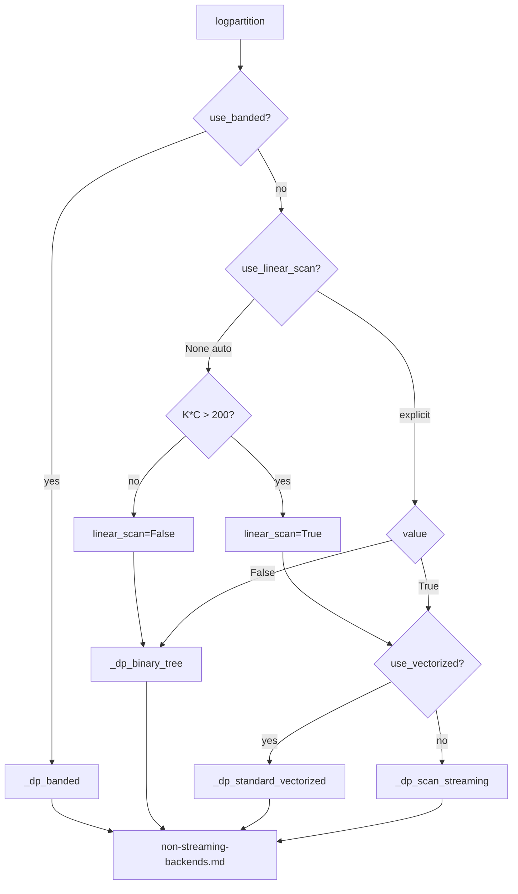

# Sentinel: Dispatch Overview

**Verified against:**
- `src/flash_semicrf/streaming/autograd.py` @ commit `ebdfcba` (+ uncommitted changes)
- `src/flash_semicrf/semimarkov.py` @ commit `ebdfcba`

**Linked tests:** `tests/test_streaming_triton.py::TestDispatch`, `tests/test_semimarkov.py`

## Summary

The flash-semicrf library provides two API families:

1. **Streaming API** (`semi_crf_streaming_forward`) - Computes edges on-the-fly from cumulative scores. Memory-efficient for long sequences. Entry point: `autograd.py:474`

2. **Non-Streaming API** (`SemiMarkov.logpartition`) - Operates on pre-computed edge tensors. Multiple algorithm variants. Entry point: `semimarkov.py:35`

**Duration Indexing:** The APIs use a mixed convention (see non-streaming-backends.md for details):

| API / Algorithm Family | Convention | Access Pattern |
|------------------------|------------|----------------|
| **Streaming** (all paths) | 0-based | `dur_idx = k - 1` |
| **Non-streaming** linear scan family | 0-based | `dur_idx = dur - 1` or `arange(0, k_eff)` |
| **Non-streaming** binary tree family | 1-based | `lp[:, :, 1:K]` (index 0 unused) |
| **Utilities** (`to_parts`/`from_parts`) | 0-based | Updated at commit `f9298c5` |

## Active Assumptions

### Mechanically Verified

These are verified automatically via `python3 verify-assumptions.py dispatch-overview`.

| ID | Assumption | Verification |
|----|------------|--------------|
| D1 | K=1 dispatches to LinearCRFStreaming | anchor: K1_DISPATCH |
| D2 | K=2 dispatches to SemiCRFK2Streaming | anchor: K2_DISPATCH |
| D3 | K>=3 GPU checks can_use_triton | anchor: CAN_USE_TRITON |
| D4 | Triton path uses SemiCRFStreamingTriton | anchor: TRITON_DISPATCH |

### Agent-Verified (on trace load)

These require human/agent judgment when loading the trace.

| ID | Assumption | Verification Guidance |
|----|------------|----------------------|
| D5 | K boundary conditions use correct comparisons | Inspect K==1, K==2, K>=3 conditionals in dispatch function (~lines 580-650) |

## Decision Tree: Streaming API



## Decision Tree: Non-Streaming API

**Entry:** `SemiMarkov(semiring).logpartition()` at `semimarkov.py:35`



## Non-Streaming Algorithm Lookup

| Condition | Algorithm | Method | Trace |
|-----------|-----------|--------|-------|
| `use_banded=True` | Banded binary tree | `_dp_banded` | non-streaming-backends.md |
| `K*C <= 200` (auto) | Binary tree | `_dp_binary_tree` | non-streaming-backends.md |
| `K*C > 200`, vectorized | Vectorized scan | `_dp_standard_vectorized` | non-streaming-backends.md |
| `K*C > 200`, default | Ring buffer scan | `_dp_scan_streaming` | non-streaming-backends.md |

**Auto-selection:** `semimarkov.py:62-65`

```python
K_C_product = K * C
use_linear_scan = K_C_product > 200
```

## Semiring Availability

| API Level | Available Semirings | How Selected |
|-----------|---------------------|--------------|
| `SemiMarkovCRFHead` (nn.py) | log, max only | Implicit: forward/loss=log, decode=max |
| `semi_crf_streaming_forward` (autograd.py) | log, max only | `semiring` parameter ("log" or "max") |
| Triton kernel K>=3 | log, max only | Two kernels: `scan_kernel` (log), `scan_kernel_max` (max) |
| PyTorch reference K>=3 | log, max only | Runtime branch: `if semiring == "log"` |
| PyTorch reference K=1 | log, max only | Separate functions: `forward` (log), `viterbi` (max) |
| PyTorch reference K=2 | log, max only | Separate functions: `forward` (log), `viterbi` (max) |
| `SemiMarkov.logpartition` (semimarkov.py) | **All 7 semirings** | `SemiMarkov(semiring_class)` constructor |

The non-streaming API supports Log, Max, Std, KMax, Entropy, CrossEntropy, and KLDivergence semirings. See non-streaming-backends.md for details on each.

## Streaming Dispatch Conditions

### can_use_triton (line 673)

```python
can_use_triton = HAS_TRITON and use_triton and cum_scores.is_cuda
```

- `HAS_TRITON`: Triton import succeeded (line 20-26)
- `use_triton`: User parameter (default True)
- `cum_scores.is_cuda`: Input is on GPU

### needs_grad (lines 599-606)

```python
# Gate on torch.is_grad_enabled() so torch.no_grad() with trainable params
# (e.g. model.decode() during training) correctly takes the inference path.
needs_grad = torch.is_grad_enabled() and (
    cum_scores.requires_grad
    or transition.requires_grad
    or duration_bias.requires_grad
    or (proj_start is not None and proj_start.requires_grad)
    or (proj_end is not None and proj_end.requires_grad)
)
```

### Max Semiring Guard (lines 610-616)

```python
if semiring == "max" and needs_grad:
    raise ValueError(
        "semiring='max' (Viterbi) does not support gradients. "
        "The max semiring computes the highest-scoring path, which is not "
        "differentiable. Use torch.no_grad() for decoding, or semiring='log' for training."
    )
```

## Streaming Lookup Table

| K | Device | Triton | needs_grad | Boundaries | Path | Trace |
|---|--------|--------|------------|------------|------|-------|
| 1 | any | any | yes | no | LinearCRFStreaming | k1-linear-crf.md |
| 1 | any | any | no | no | linear_crf_*_pytorch | k1-linear-crf.md |
| 1 | any | any | any | yes | K>=3 path | (see below) |
| 2 | any | any | yes | no | SemiCRFK2Streaming | k2-fast-path.md |
| 2 | any | any | no | no | semi_crf_k2_*_pytorch | k2-fast-path.md |
| 2 | any | any | any | yes | K>=3 path | (see below) |
| >=3 | GPU | yes | yes | any | SemiCRFStreamingTriton | triton-forward-k3plus.md |
| >=3 | GPU | yes | no | any | launch_streaming_triton_kernel | triton-forward-k3plus.md |
| >=3 | CPU | any | yes | any | SemiCRFStreaming | pytorch-forward-k3plus.md |
| >=3 | CPU | any | no | any | semi_crf_streaming_forward_pytorch | pytorch-forward-k3plus.md |

## Failure Mode Routing

### Streaming API Issues

| Symptom | Primary Trace | Secondary Trace | Check First |
|---------|---------------|-----------------|-------------|
| **NaN in loss** | triton-forward-k3plus.md | dispatch-overview.md | NEG_INF guards |
| **NaN in backward** | triton-backward-k3plus.md | pytorch-backward-k3plus.md | Partition validation (lines 88, 224) |
| **Wrong gradients** | triton-backward-k3plus.md | pytorch-backward-k3plus.md | Cross-reference outputs |
| **OOM on GPU** | triton-backward-k3plus.md | - | Recomputation Logic section |
| **K=1/K=2 mismatch** | k1-linear-crf.md / k2-fast-path.md | dispatch-overview.md | Dispatch conditions |
| **Triton vs PyTorch diff** | triton-forward-k3plus.md | pytorch-forward-k3plus.md | Ring buffer indexing |

### Non-Streaming API Issues

| Symptom | Primary Trace | Check First |
|---------|---------------|-------------|
| **OOM with large edge tensor** | non-streaming-backends.md | Use streaming API instead |
| **Slow binary tree** | non-streaming-backends.md | Check K*C > 200 threshold |
| **Algorithm mismatch** | non-streaming-backends.md | Verify all algorithms produce same result |
| **Duration index off-by-one** | non-streaming-backends.md | Verify `dur_idx = k - 1` |

## Entry Points

### Streaming API (autograd.py)

| Function | Line | Called When |
|----------|------|-------------|
| `semi_crf_streaming_forward()` | 498 | Public API entry point |
| `LinearCRFStreaming.apply()` | 627 | K=1, needs_grad, no boundaries |
| `SemiCRFK2Streaming.apply()` | 653 | K=2, needs_grad, no boundaries |
| `SemiCRFStreamingTriton.apply()` | 679 | K>=3, GPU, Triton, needs_grad |
| `SemiCRFStreaming.apply()` | 693 | K>=3, no Triton, needs_grad |
| `launch_streaming_triton_kernel()` | 706 | K>=3, GPU, Triton, inference |
| `semi_crf_streaming_forward_pytorch()` | 720 | K>=3, CPU, inference |

### Non-Streaming API (semimarkov.py)

| Function | Line | Called When |
|----------|------|-------------|
| `SemiMarkov.logpartition()` | 35 | Public API entry point |
| `_dp_binary_tree()` | 85 | K*C <= 200 (auto) or explicit |
| `_dp_scan_streaming()` | 150 | K*C > 200, default |
| `_dp_standard()` | 230 | Legacy reference implementation |
| `_dp_standard_vectorized()` | 277 | K*C > 200, use_vectorized=True |
| `_dp_blocktriangular()` | 326 | Block-triangular variant |
| `_dp_banded()` | 503 | use_banded=True |

## Critical Invariants

### Duration Indexing (mixed convention)

- [ ] **Streaming** (all paths): `dur_idx = k - 1` for duration value `k` (0-based)
- [ ] **Non-streaming** linear scan family: `dur_idx = dur - 1` (0-based, matches streaming)
- [ ] **Non-streaming** binary tree family: `lp[:, :, 1:K]` (1-based, index 0 unused)
- [ ] `duration_bias` shape: `(K, C)` - 0-based in streaming, mixed in non-streaming
- [ ] Edge tensor last dims: `(c_dst, c_src)` - destination first (consistent)

### Streaming API

- [ ] K>=3 required for ring buffer architecture (Triton kernel constraint)
- [ ] K=1/K=2 fast paths do NOT support boundary projections
- [ ] Boundary projections force fallback to K>=3 path even for K=1/K=2
- [ ] `cum_scores` MUST be float32 or float64 (float64 recommended; matches Triton kernel precision)
- [ ] `needs_grad` gates on `torch.is_grad_enabled()` for safe decode during training
- [ ] Max semiring raises ValueError when gradients required

### Non-Streaming API

- [ ] Auto-selection threshold: `K*C > 200` triggers linear scan
- [ ] All algorithms produce identical partition values (numerical precision aside)
- [ ] Ring buffer in `_dp_scan_streaming` uses `(head - (dur - 1)) % K`

## Numerical Guards

| Location | Guard | Purpose |
|----------|-------|---------|
| autograd.py:~98 | `torch.isfinite(partition)` | Validate partition before PyTorch backward |
| autograd.py:~234 | `torch.isfinite(partition)` | Validate partition before Triton backward |
| autograd.py:~356 | `torch.isfinite(partition)` | Validate partition before K=1 backward |
| autograd.py:~448 | `torch.isfinite(partition)` | Validate partition before K=2 backward |
| autograd.py:~121 | `torch.isfinite(grad_cum_scores)` | Validate PyTorch backward output |
| autograd.py:~264 | `torch.isfinite(grad_*)` | Validate Triton backward outputs |
| autograd.py:610-616 | `semiring == "max" and needs_grad` | Reject Viterbi in grad-enabled context |

## Known Issues

| Issue | Severity | Frequency | Resolution | Commit |
|-------|----------|-----------|------------|--------|
| K=1/K=2 ring buffer aliasing | Critical | Always with K<3 | Dispatch to specialized paths | `870bd1f` |
| Boundaries force K>=3 path | Medium | When boundaries used with K<3 | Document; specialized paths don't support boundaries | - |

## Version History

- **2026-02-12**: Updated `needs_grad` to gate on `torch.is_grad_enabled()` (line 601); documented max semiring ValueError guard (line 610); updated all entry point and numerical guard line numbers; autograd.py to `ebdfcba` + uncommitted, semimarkov.py to `ebdfcba`
- **2026-02-09**: Updated autograd.py commit (STAGED): float32→float64 in docstrings, cum_scores invariant relaxed to accept float64
- **2026-02-09**: Corrected duration indexing to document mixed convention (binary tree 1-based, scan 0-based); added Semiring Availability table; updated semimarkov.py to commit `f9298c5`
- **2026-02-05**: Updated autograd.py to commit `6c463c3`; no dispatch logic changes (added checkpoint_interval parameter and dtype conversion handling)
- **2026-02-01**: Updated line numbers for autograd.py changes (log_norm_checkpoints support)
- **2026-01-28**: Documented dual indexing scheme divergence (streaming 0-based vs non-streaming 1-based)
- **2026-01-28**: Added non-streaming backends (`semimarkov.py`) decision tree, algorithm lookup, entry points, and failure routing @ commit `26119fa`
- **2026-01-27**: Initial trace (streaming API only) @ commit `26119fa`
