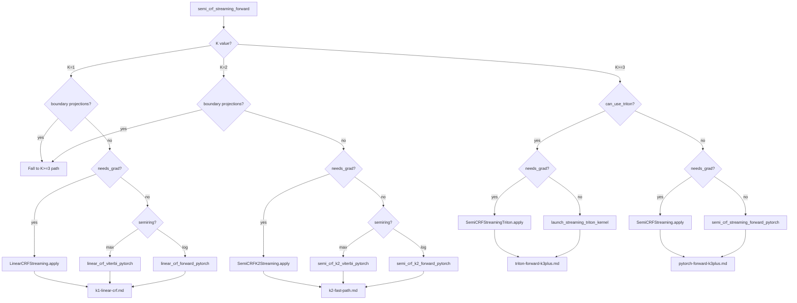

# Sentinel: Dispatch Overview

**Verified against:** `src/torch_semimarkov/streaming/autograd.py` @ commit `40fe66b`
**Linked tests:** `tests/test_streaming_triton.py::TestDispatch`

## Summary

The dispatch hub routes Semi-CRF computations to the optimal backend based on K value, device, gradient requirements, and Triton availability. All paths enter through `semi_crf_streaming_forward()` at line 474.

## Decision Tree



## Dispatch Conditions

### can_use_triton (line 636)

```python
can_use_triton = HAS_TRITON and use_triton and cum_scores.is_cuda
```

- `HAS_TRITON`: Triton import succeeded (line 20-26)
- `use_triton`: User parameter (default True)
- `cum_scores.is_cuda`: Input is on GPU

### needs_grad (lines 573-579)

```python
needs_grad = (
    cum_scores.requires_grad
    or transition.requires_grad
    or duration_bias.requires_grad
    or (proj_start is not None and proj_start.requires_grad)
    or (proj_end is not None and proj_end.requires_grad)
)
```

## Lookup Table

| K | Device | Triton | needs_grad | Boundaries | Path | Trace |
|---|--------|--------|------------|------------|------|-------|
| 1 | any | any | yes | no | LinearCRFStreaming | k1-linear-crf.md |
| 1 | any | any | no | no | linear_crf_*_pytorch | k1-linear-crf.md |
| 1 | any | any | any | yes | K>=3 path | (see below) |
| 2 | any | any | yes | no | SemiCRFK2Streaming | k2-fast-path.md |
| 2 | any | any | no | no | semi_crf_k2_*_pytorch | k2-fast-path.md |
| 2 | any | any | any | yes | K>=3 path | (see below) |
| >=3 | GPU | yes | yes | any | SemiCRFStreamingTriton | triton-forward-k3plus.md |
| >=3 | GPU | yes | no | any | launch_streaming_triton_kernel | triton-forward-k3plus.md |
| >=3 | CPU | any | yes | any | SemiCRFStreaming | pytorch-forward-k3plus.md |
| >=3 | CPU | any | no | any | semi_crf_streaming_forward_pytorch | pytorch-forward-k3plus.md |

## Failure Mode Routing

| Symptom | Primary Trace | Secondary Trace | Check First |
|---------|---------------|-----------------|-------------|
| **NaN in loss** | triton-forward-k3plus.md | dispatch-overview.md | NEG_INF guards |
| **NaN in backward** | triton-backward-k3plus.md | pytorch-backward-k3plus.md | Partition validation (lines 88, 224) |
| **Wrong gradients** | triton-backward-k3plus.md | pytorch-backward-k3plus.md | Cross-reference outputs |
| **OOM on GPU** | triton-backward-k3plus.md | - | Recomputation Logic section |
| **K=1/K=2 mismatch** | k1-linear-crf.md / k2-fast-path.md | dispatch-overview.md | Dispatch conditions |
| **Triton vs PyTorch diff** | triton-forward-k3plus.md | pytorch-forward-k3plus.md | Ring buffer indexing |

## Entry Points

| Function | Line | Called When |
|----------|------|-------------|
| `semi_crf_streaming_forward()` | 474 | Public API entry point |
| `LinearCRFStreaming.apply()` | 590 | K=1, needs_grad, no boundaries |
| `SemiCRFK2Streaming.apply()` | 616 | K=2, needs_grad, no boundaries |
| `SemiCRFStreamingTriton.apply()` | 642 | K>=3, GPU, Triton, needs_grad |
| `SemiCRFStreaming.apply()` | 655 | K>=3, no Triton, needs_grad |
| `launch_streaming_triton_kernel()` | 669 | K>=3, GPU, Triton, inference |
| `semi_crf_streaming_forward_pytorch()` | 683 | K>=3, CPU, inference |

## Critical Invariants

- [ ] K>=3 required for ring buffer architecture (Triton kernel constraint)
- [ ] K=1/K=2 fast paths do NOT support boundary projections
- [ ] Boundary projections force fallback to K>=3 path even for K=1/K=2
- [ ] `cum_scores` MUST be float32 for numerical stability

## Numerical Guards

| Location | Guard | Purpose |
|----------|-------|---------|
| autograd.py:88-95 | `torch.isfinite(partition)` | Validate partition before PyTorch backward |
| autograd.py:224-231 | `torch.isfinite(partition)` | Validate partition before Triton backward |
| autograd.py:339-345 | `torch.isfinite(partition)` | Validate partition before K=1 backward |
| autograd.py:431-437 | `torch.isfinite(partition)` | Validate partition before K=2 backward |
| autograd.py:115-121 | `torch.isfinite(grad_cum_scores)` | Validate PyTorch backward output |
| autograd.py:254-265 | `torch.isfinite(grad_*)` | Validate Triton backward outputs |

## Known Issues

| Issue | Severity | Frequency | Resolution | Commit |
|-------|----------|-----------|------------|--------|
| K=1/K=2 ring buffer aliasing | Critical | Always with K<3 | Dispatch to specialized paths | `870bd1f` |
| Boundaries force K>=3 path | Medium | When boundaries used with K<3 | Document; specialized paths don't support boundaries | - |

## Version History

- **2026-01-27**: Initial trace @ commit `40fe66b`
